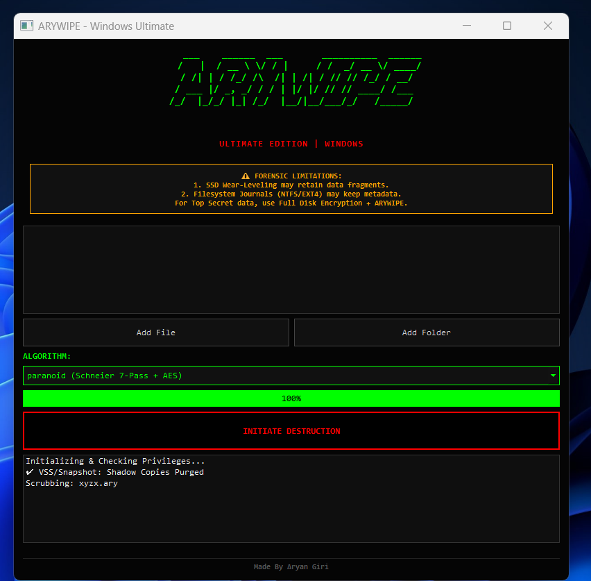
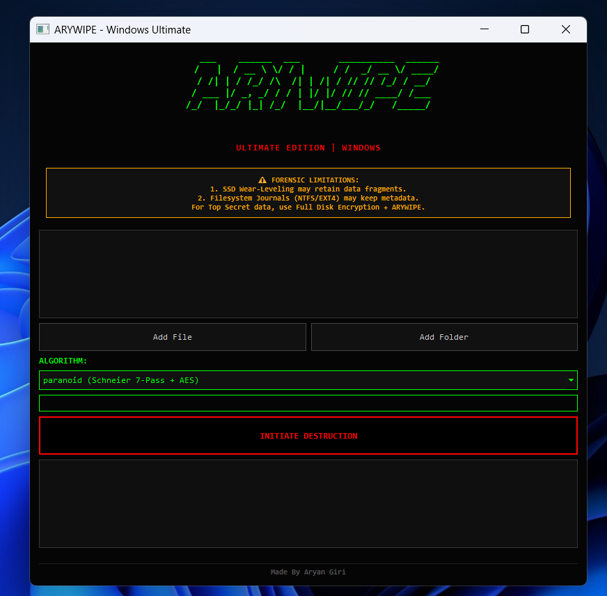

## Screenshots





# 💀 ARYWIPE – Final README (Professional Edition)

## **Secure Data Destruction Tool**

### *Ultimate Forensic-Grade File & Directory Wiper*

### **Platforms:** Windows • Linux • macOS

### **Author:** *Aryan Giri*

---

## 🔒 **About The Project**

ARYWIPE is a cross‑platform data destruction utility designed for **permanent, irreversible deletion** of sensitive information. Unlike ordinary deletion methods that leave recoverable traces, ARYWIPE uses **multi-layer sanitization**, **cryptographic shredding**, and **anti-forensic techniques** to eliminate any meaningful recovery path.

This tool is intended for:

* Cybersecurity researchers
* Privacy-focused users
* Data sanitization labs
* Digital forensics students (ethical & defensive use only)

---

## ⚡ **Key Features**

### 🛡️ **Multi‑Layer Destruction Pipeline**

1. **AES‑256 Stream Encryption** – Converts file contents into high‑entropy ciphertext.
2. **Overwrite Engine** – Applies Random, DoD 5220.22‑M, or Schneier 7‑Pass overwrite patterns.
3. **Anti‑Forensic Obfuscation** – UUID renaming, timestamp wiping, and attribute clearing.

### 🌍 **Cross‑Platform Intelligence**

* **Windows** → Detection & optional clearing of *Volume Shadow Copies (VSS)*.
* **macOS** → Detection & removal of *local Time Machine snapshots*.
* **Linux** → Handles *immutable attributes* (`chattr -i`).

### 🧠 **Smart Guardrails**

* Critical path protection (blocks wiping `/`, `/etc`, or `C:\Windows`).
* Symlink firewall (unlinks without touching targets).
* Resident/MFT/Inode inflation to force true block allocation.

### 🛑 **Forensic Countermeasures**

* Multi-stage UUID renaming to break directory table reconstruction.
* Timestamp flattening (Unix Epoch / 1980 standard).
* Safe RAM cleanup for sensitive key material.

### 🎨 **Modern GUI**

* PyQt5-based dark interface.
* Real‑time progress tracking.
* Multi-threaded operations without UI freeze.

---

## 📥 **Installation**

### **Prerequisites**

* Python 3.8+
* Pip

### **Setup**

```bash
git clone https://github.com/giriaryan694-a11y/ARYWIPE.git
cd ARYWIPE
pip install -r requirements.txt
```

Or manually:

```bash
pip install PyQt5 cryptography pyfiglet
```

---

## 🚀 **Usage**

Run the interface:

```bash
python main.py
```

### **Algorithm Options**

| Mode         | Passes   | Description                       | Recommended For            |
| ------------ | -------- | --------------------------------- | -------------------------- |
| **Random**   | AES + 3  | AES encrypt + 3 random overwrites | General secure use         |
| **Paranoid** | AES + 7  | AES encrypt + Schneier 7-pass     | Sensitive research data    |
| **Legacy**   | AES + 35 | AES encrypt + Gutmann             | HDD-only, archival formats |

> ⚠️ Gutmann is not useful for modern SSD/NVMe.

### **Recommended (Safe) Workflow**

1. Add files/directories.
2. Select overwrite algorithm.
3. Confirm safety prompt.
4. Begin destruction.
5. Verify results via logs.

---

## ⚠️ **Important Limitations**

Even advanced wipers cannot overcome certain hardware and OS behaviors:

### 🔸 **SSD Wear-Leveling**

SSDs may retain ghost blocks due to internal remapping.

* **Solution:** Use ARYWIPE + Full Disk Encryption (BitLocker / LUKS / FileVault).

### 🔸 **Journaling Filesystems**

NTFS, EXT4, and APFS may preserve metadata in their journals.

* ARYWIPE scrubs filenames & timestamps but cannot rewrite journal internals.

### 🔸 **Snapshots & Shadow Copies**

Run as Administrator/Root to remove OS snapshots; otherwise remnants may persist.

---

## 🛠️ **Technical Architecture**

### **Sanitization Workflow**

1. Attribute unlock (`attrib`, `chattr`).
2. Resident-file inflation (forces full block write).
3. AES‑256‑CFB cryptographic shredding.
4. Overwrite engine (pattern-based).
5. Triple-UUID renaming cycle.
6. Timestamp wiping (access, modified, created).
7. Truncation to 0 bytes.
8. Unlinking from filesystem.

This layered approach ensures maximum resilience against:

* Carving tools
* Partial block recovery
* Directory entry forensics
* Basic to intermediate forensic tools

---

## ⚖️ **Disclaimer**

This tool is provided **for ethical, defensive, and educational purposes only**.
The author is not responsible for misuse or accidental data destruction.
Once a file is wiped using ARYWIPE, it **cannot be recovered**.

---

## 📜 **License**

**MIT License © 2025 – Aryan Giri**
Free to use, modify, and distribute with proper credit.

---

## ⚡ *“Erase like a ghost. Leave no trace.”*⚡
